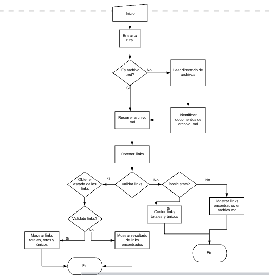

# Markdown Links

## 1. Qué es Markdown Links

Md-links es una librería creada con Node. js con la que el usuario podrá analizar los archivos Markdown, quienes descarguen esta herramienta podrán extraer los links, que contengan los archivos con extensión .md, así mismo podrá hacer la validación de los estados en los enlaces encontrados lo cual permite conocer si los enlaces validos y no validos, al mismo tiempo que reporta estadísticas de los enlaces.

## 2. Diagrama de Flujo de Md-links

## 3. Cómo extraer las los desde la librería Md-links

El usuario debe proporcionar la ruta en la que se encuentran los archivos markdown que desee analizar. Estos links también pueden ser analizados con las opciones, "--validate" y "--stats".

## 4. Historias de Usuarios
    • Historia 1:
Yo como desarrollador  quiero poder acceder a la ruta dependiendo si es relativa o absoluta.

Criterios de aceptación:
-Identificar archivos
-Poder ejecutar el programa en la consola

    • Historia 2 :
Yo como desarrollador quiero poder ingresar una ruta absoluta e identificar si el archivo es .md

Criterios de aceptación:
-Leer archivo
-visualizar lo que contiene en consola como primer paso

    • Historia 3:
Yo como desarrollador quiero recorrer documentos que se encuentren en el directorio de una ruta relativa hasta encontrar el archivo .md

Criterios de aceptación:
-Recorrer directorio de una ruta específica
-Encontrar los archivos .md
-visualizar los archivos en pantalla

    • Historia 4:
Yo como desarrollador quiero poder acceder a los links que contengan los archivos .md

Criterios de aceptación:
-Buscar los links en el archivo .md
-Listar los links encontrados
-Acceder a los links encontrados

    • Historia 5:
Yo como desarrollador quiero obtener estadísticas del total de los links validos y no validos

Criterios de aceptación:
-Buscar los links en el archivo .md
-Contabilizar los links válidos y no válidos

## 5. Cómo instalar md-links
    • Instalar la librería vía npm install  (comando de instalación)

